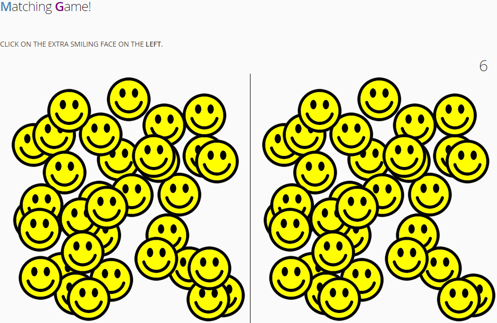

# Matchin Game

this little game was developed with **Vaadin Framework**

The left and right sides are identical, except for one thing: the left side has one extra face. The user needs to click on that extra face. If anything except the correct face is clicked, a message is displayed saying that the game is over. If the correct face is clicked, all the currently displayed faces are deleted and a new set of faces is shown at random positions. Each time a new set of faces is shown there will be 5 more faces than before, on both the left and the right sides. There will always be one extra face shown on the left.

After clicking on the extra face (at the top) all the faces disappear and the following new set of faces are shown. As you can see, on both sides 5 more faces than before are shown.

The game ends when the player clicks on anything except the correct face.

